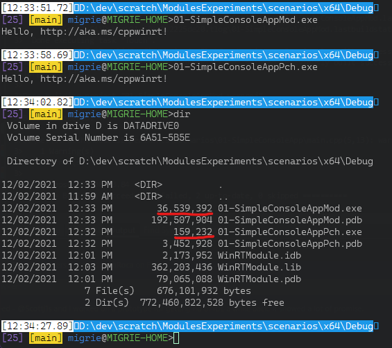

Start here:
* [C++ modules conformance #495](https://github.com/microsoft/cppwinrt/pull/495)


> The `cppwinrt.exe` compiler will now generate a `winrt/winrt.ixx` file that may be compiled as a module as follows:
>
> ```
> cl /c /I . /experimental:module /EHsc /bigobj /std:c++17 /await winrt/winrt.ixx
> ```
>
> This will compile all of the projected namespaces into a single `winrt` module. This step takes quite a while - around 2 minutes on my machine. But once that's built, much like a PCH, you can import the module into any (compatible) TU very quickly as follows:
>
> ```
> cl /experimental:module /EHsc /std:c++17 /await app.cpp winrt.obj
> ```

I'm not sure how I generated that the first time around. Just copy-pasta'd the implementation of cppwinrt from the Terminal project? probably.

--------------------------------------------------------------------------------

<details>
<summary>
Original notes, circa may 2021
</summary>

```bat
[ 9:19:44.22]>C:\Users\migrie\dev\scratch\PchSizeExperiments\ConsoleApp>
migrie@MIGRIE-SLAPTOP>cl /c /I "Debug\Generated Files" /experimental:module /EHsc /bigobj /std:c++17 /await "Debug\Generated Files\winrt\winrt.ixx"

cl  /JMC /experimental:module /Yu"pch.h" /GS /W4 /Zc:wchar_t /ZI /Gm- /Od /Zc:inline /fp:precise /D "_DEBUG" /D "_CONSOLE" /D "WIN32_LEAN_AND_MEAN" /D "WINRT_LEAN_AND_MEAN" /D "_UNICODE" /D "UNICODE" /errorReport:prompt /WX- /Zc:forScope /RTC1 /Gd /MDd /std:c++latest /FC /EHsc /nologo /Fo"x64\Debug\" /Fp"x64\Debug\pch.pch" /diagnostics:column  /await main.cpp winrt.obj


cl /experimental:module /Yu"pch.h" /Fp"x64\Debug\pch.pch" /EHsc /std:c++17 /await main.cpp winrt.obj

cl /experimental:module /D _DEBUG /D _CONSOLE /D WIN32_LEAN_AND_MEAN /D WINRT_LEAN_AND_MEAN /D _UNICODE /D UNICODE /Gm- /fp:precise /Zc:wchar_t /Zc:forScope /Zc:inline /Yu"pch.h" /Fp"x64\Debug\pch.pch" /EHsc /std:c++17 /await main.cpp winrt.obj


CL.exe /c  /W4 /WX- /Od /D _DEBUG /D _CONSOLE /D WIN32_LEAN_AND_MEAN /D WINRT_LEAN_AND_MEAN /D _UNICODE /D UNICODE /Gm- /EHsc /fp:precise /Zc:wchar_t /Zc:forScope /Zc:inline /std:c++latest /experimental:module /Yc"pch.h" /Fp"x64\Debug\pch.pch" /Fo"x64\Debug\\" /permissive- /bigobj /await /bigobj pch.cpp

CL.exe /c /D _DEBUG /D _CONSOLE /D WIN32_LEAN_AND_MEAN /D WINRT_LEAN_AND_MEAN /D _UNICODE /D UNICODE /Gm- /EHsc /fp:precise /Zc:wchar_t /Zc:forScope /Zc:inline /std:c++latest /experimental:module /Yc"pch.h" /Fp"x64\Debug\pch.pch" /Fo"x64\Debug\\" /bigobj /await /bigobj pch.cpp


cl /c /experimental:module /D _DEBUG /D _CONSOLE /D WIN32_LEAN_AND_MEAN /D WINRT_LEAN_AND_MEAN /D _UNICODE /D UNICODE /Gm- /fp:precise /Zc:wchar_t /Zc:forScope /Zc:inline /Yu"pch.h" /Fp"x64\Debug\pch.pch" /EHsc /std:c++latest /await main.cpp winrt.obj

```

These three did it:
```
cl /c /D _DEBUG /D _CONSOLE /D WIN32_LEAN_AND_MEAN /D WINRT_LEAN_AND_MEAN /D _UNICODE /D UNICODE /Gm- /EHsc /fp:precise /Zc:wchar_t /Zc:forScope /Zc:inline /std:c++latest /experimental:module /Yc"pch.h" /Fp"x64\Debug\pch.pch" /Fo"x64\Debug\\" /bigobj /await /bigobj pch.cpp

cl /c /experimental:module /D _DEBUG /D _CONSOLE /D WIN32_LEAN_AND_MEAN /D WINRT_LEAN_AND_MEAN /D _UNICODE /D UNICODE /Gm- /fp:precise /Zc:wchar_t /Zc:forScope /Zc:inline /Yu"pch.h" /Fp"x64\Debug\pch.pch" /EHsc /std:c++latest /await main.cpp

link /out:main.exe main.obj winrt.obj "x64\Debug\pch.obj"
```


```
cl /c /I . /D _DEBUG /experimental:module /D _UNICODE /D UNICODE /Gm- /EHsc /fp:precise /Zc:wchar_t /Zc:forScope /Zc:inline /bigobj /std:c++17 /await winrt.ixx

cl /c /D _DEBUG /D _CONSOLE /D WIN32_LEAN_AND_MEAN /D WINRT_LEAN_AND_MEAN /D _UNICODE /D UNICODE /Gm- /EHsc /fp:precise /Zc:wchar_t /Zc:forScope /Zc:inline /std:c++latest /experimental:module /Yc"pch.h" /Fp"x64\Debug\pch.pch" /Fo"x64\Debug\\" /bigobj /await /bigobj pch.cpp

cl /c /experimental:module /D _DEBUG /D _CONSOLE /D WIN32_LEAN_AND_MEAN /D WINRT_LEAN_AND_MEAN /D _UNICODE /D UNICODE /Gm- /fp:precise /Zc:wchar_t /Zc:forScope /Zc:inline /Yu"pch.h" /Fp"x64\Debug\pch.pch" /EHsc /std:c++latest /await main.cpp

link /out:main.exe main.obj winrt.obj "x64\Debug\pch.obj"

```

Curious,
```
cl /c /I . /experimental:module /EHsc /bigobj /std:c++17 /await winrt.ixx
```
Worked, but
```
cl /c /I . /D _DEBUG /experimental:module /EHsc /bigobj /std:c++17 /await winrt.ixx
```

Did _not_.


Okay, awesome. You can totally include headers in pch.h, AND modules. At least the WinRT module works.

* [x] Is compiling with `/std:c++latest` necessary, or would `/std:c++17` work?
  - Module: maybe? I think so? It moved the output from `x64\Release\CppWinRTModule\winrt.ixx.{obj,ifc}` instead to `$(SolutionDir)\CppWinRTModule\winrt.ifc` and `$(SolutionDir)\CppWinRTModule\x64\Release\winrt.obj`.
  - ModuleConsoleApp: totally fine.
* [ ] Update the module project to succeed when built. Right now it's still trying to build an exe
* [ ] Can I configure the module project to build successfully in Debug?
* [ ] update the module project to auto-generate contents in `winrt/`. I had to copypasta those manually
* [x] Create a helper `.props` for including the winrt module project in another project. Including things like the `AdditionalModuleDefinitions` and the `obj` file thing
* [ ] Can I make my own library module? e.g. for `TerminalControl`. That's probably overkill now, but will be important for something like TerminalApp, which imports `winrt` and `TerminalControl`
  - This is proving to be much harder than I anticipated. It's unclear how to create a module that uses winrt, that can also be consumed by another project that uses `winrt`.
    - The VS system for referencing modules from other projects is useless.
    - I keep getting `fatal error C1117: unrecoverable error importing module ... IInspectable already defined`, which is a fatal compiler error that totally blocks me.
    - I'm going to need someone's official help here. Too bad there's no one on the cppwinrt team to help with that.
* [ ] Can I include this madness in the Samples.sln in the Terminal? Because that would be an e2e PoC.

```
MSVC\14.28.29910\bin\HostX86\x64\CL.exe /c /Zi /nologo /W3 /WX- /diagnostics:column /sdl /O2 /Oi /GL /D NDEBUG /D _CONSOLE /D _CONSOLE /D WIN32_LEAN_AND_MEAN /D WINRT_LEAN_AND_MEAN /D _UNICODE /D UNICODE /Gm- /EHsc /MD /GS /Gy /fp:precise /permissive- /Zc:wchar_t /Zc:forScope /Zc:inline /std:c++17 /experimental:module /stdIfcDir "C:\Program Files (x86)\Microsoft Visual Studio\2019\Enterprise\VC\Tools\MSVC\14.28.29910\ifc\x64" /Fo"x64\Release\\" /Fd"x64\Release\vc142.pdb" /Gd /TP /FC /errorReport:prompt  /permissive- /bigobj /await winrt.ixx
1>

MSVC\14.28.29910\bin\HostX86\x64\link.exe /ERRORREPORT:PROMPT /OUT:"C:\Users\migrie\dev\scratch\PchSizeExperiments\x64\Release\CppWinRTModule.exe" /INCREMENTAL:NO /NOLOGO kernel32.lib user32.lib kernel32.lib user32.lib gdi32.lib winspool.lib comdlg32.lib advapi32.lib shell32.lib ole32.lib oleaut32.lib uuid.lib odbc32.lib odbccp32.lib /MANIFEST /MANIFESTUAC:"level='asInvoker' uiAccess='false'" /manifest:embed /DEBUG /PDB:"C:\Users\migrie\dev\scratch\PchSizeExperiments\x64\Release\CppWinRTModule.pdb" /SUBSYSTEM:CONSOLE /OPT:REF /OPT:ICF /LTCG:incremental /LTCGOUT:"x64\Release\CppWinRTModule.iobj" /TLBID:1 /DYNAMICBASE /NXCOMPAT /IMPLIB:"C:\Users\migrie\dev\scratch\PchSizeExperiments\x64\Release\CppWinRTModule.lib" /MACHINE:X64 x64\Release\winrt.obj
```

okay there's nothing in that build commandline that indicates where the `ifc` and `obj` are going to land. Nuts.

</details>

--------------------------------------------------------------------------------
End of original notes.


###### z 30-Nov-2021

* Created new solution directory.
* Created a new Console Application.
  - Set it to C++20 `/std:c++20` and toolset `v143`
* Copy the `CppWinRTModule` directory into that solution.
* In `CppWinRTModule`, run: `cl /c /I . /experimental:module /EHsc /bigobj /std:c++17 /await winrt.ixx`
  - There are some warnings, about `CppWinRTModule\winrt/base.h(101): warning C5244: '#include <WindowsNumerics.impl.h>' in the purview of module 'winrt' appears erroneous`
  - This produces a 229,877,076B `winrt.ifc` and 158,347,308B `winrt.obj` (229MB and 158MB respectively).
* Add the module's `.ifc` to the `ClCompile.AdditionalModuleDependencies`, and the `.obj` to the `Link.AdditionalDependencies`

  At this point, we'll have some build errors:
  ```
  1>Done building project "BasicConsoleApplication.vcxproj" -- FAILED.
  1>
  1>Build FAILED.
  1>
  1>LINK : warning LNK4098: defaultlib 'MSVCRTD' conflicts with use of other libs; use /NODEFAULTLIB:library
  1>LINK : warning LNK4217: symbol '__acrt_iob_func' defined in 'libucrt.lib(_file.obj)' is imported by 'BasicConsoleApplication.obj' in function 'printf'
  1>LINK : warning LNK4217: symbol '__stdio_common_vfprintf' defined in 'libucrt.lib(output.obj)' is imported by 'BasicConsoleApplication.obj' in function '_vfprintf_l'
  1>BasicConsoleApplication.obj : error LNK2038: mismatch detected for '_ITERATOR_DEBUG_LEVEL': value '2' doesn't match value '0' in winrt.obj
  1>BasicConsoleApplication.obj : error LNK2038: mismatch detected for 'RuntimeLibrary': value 'MDd_DynamicDebug' doesn't match value 'MT_StaticRelease' in winrt.obj
  1>D:\dev\scratch\ModulesExperiments\ModulesExperiments\x64\Debug\BasicConsoleApplication.exe : fatal error LNK1319: 2 mismatches detected
  1>    3 Warning(s)
  1>    3 Error(s)
  ```

* Added the module project to the new solution. Updated toolset to 143, std to c++20
* Build that project. Fails to build, but produces `x64\Debug\winrt.ixx.ifc` and `x64\Debug\winrt.ixx.obj`. Let's use those.
  - [ ] Replace that project with one that just builds the module, successfully.
  - [ ] **FOLLOW UP** Why is there no Module project template in VS? How do I just build a module as a single project? A library maybe?
* In the console app, chaged the include to
  ```xml
      <AdditionalModuleDependencies>$(SolutionDir)CppWinRTModule\$(Platform)\$(Configuration)\winrt.ixx.ifc;%(AdditionalModuleDependencies)</AdditionalModuleDependencies>

      ...

      <AdditionalDependencies>$(SolutionDir)CppWinRTModule\$(Platform)\$(Configuration)\winrt.ixx.obj;%(AdditionalDependencies)</AdditionalDependencies>
  ```
* Sure as shit, that compiles and runs successfully. That's great!
- [ ] **FOLLOW UP**: What's the actually right way to have one project in VS depend on a module project? I should be able to just add it as a reference, right? It should be seamless.
* Add a new Runtime Component project to the solution. This should build perfectly fine.
* Struggle with mismatched winrt headers.
* IN `ModulesExperiments\ModulesExperiments\CppWinRTModule`, ~`"C:\Program Files (x86)\Windows Kits\10\bin\10.0.22000.0\x64\cppwinrt.exe" -verbose -ref local -prefix -opt -out .` was the command that actually ended up generating the projection!~
  - That of course uses `2.0.201201.7`, which is not the most up to date cppwinrt version. That's probably jsut the one that ships with VS
  - `"D:\dev\scratch\ModulesExperiments\ModulesExperiments\packages\Microsoft.Windows.CppWinRT.2.0.210806.1\bin\cppwinrt.exe" -verbose -overwrite -ref local -prefix -opt -out D:\dev\scratch\ModulesExperiments\ModulesExperiments\CppWinRTModule` works better
  - GAH that didn't generate the ixx...? Wait no that's in the `winrt/` subdir
  - DON'T just `-overwrite` if you do the `cppwinrt.exe` command wrong. May leave behind headers with the wrong version, and the compiler i guess just powers through. Clean everything up, then do the right thing.
  - Actually no, that wasn't the issue. We're still including the `base.h` from the SDK, which has a different cppwinrt version. So manually defining `#define CPPWINRT_VERSION "2.0.210806.1"` will make it obvious that we're including the wrong one.
  - IMPORTANT: Add this to the _bottom_ of the module vcxproj:
    ```xml

    <ItemDefinitionGroup>
      <ClCompile>
        <AdditionalIncludeDirectories>$(SolutionDir)CppWinRTModule;%(AdditionalIncludeDirectories)</AdditionalIncludeDirectories>
      </ClCompile>
    </ItemDefinitionGroup>
    ```
    This will allow the module to build with the winrt headers that it generated, rather than the ones that come with the SDK.
* Okay, so admittedly I don't need this, so I'm just removing it. But I hit an error where the compiler seemed to think that `Windows.UI.Composition.Particles.h` didn't exist, when it 100% did.
  - I literally just commented it out in the _generated_ `winrt.ixx`. I Shouldn't do that, but I did.
  - This was reproducible when deleting the entire `winrt/` directory and rebuilding the module. That's mental.
* That compiled the module again!
* Now, when we compile the runtime component, we're running into `unresolved external symbol WINRT_IMPL_CoGetCallContext`
  - To fix that, stick
    ```c++
    #pragma comment (lib, "ole32")
    #pragma comment (lib, "advapi32")
    ```
    In the runtime component's `pch.h`. There's... no other `import winrt` though, which is... mysterious. I suppose I'm not really using cppwinrt at this point?
* Now, we're going to make _another_ cppwinrt console app, to try and use our component we just authored.
  - If we try just adding an `#include <winrt/WinRTComponent.h>` to the new app's pch.h, we'll get duplicated `take_ownership_from_abi`, in the module's impl and in the component's normalling included `base.h`. So now we need a way to only include one copy of that. Do we create a module for that? Seems like a solution.
* Tried making a `WinRTComponent.ixx` as a module for this component. It's going... poorly.
* Instead, made a totally separate project for the `WinRTComponentModule`, which literally just makes a module for the `WinRTComponent`. It's a static lib project, with `<ClCompile.CompileAs>CompileAsCppModule</CompileAs>`
<hr>

###### z 02-Dec-2021

Working on coming up with uniform scenarios, and implementing as both module and `pch.h`.

Observed that the module version of the exe is WAY bigger:



36.5 MB vs 159KB is 229.47x bigger. That's not gonna fly...
* [ ] **FOLLOW UP**: Is this just a debug thing? Maybe the release version is more trimmed.
* Scenario 01 was built without a hitch.
* Scenario 02 had many more issues. Notes in [`scenarios/02-SimpleAsyncAction/notes.md`](scenarios/02-SimpleAsyncAction/notes.md)

###### z 07-Dec-2021

Testing the cppwinrt#953 patch with more updated compiler verison. Checked out that branch and build cppwinrt.exe, as well as the test_cpp20 project in that solution. That seems to build fine, so hopefully it builds fine here too.

* copied the output from `cppwinrt\_build\x64\Debug\winrt` to `00-WinRTModule\winrt-with-953-patch\winrt`. Made another winrt module project that uses that instead.


<hr>

### References

These are mostly for my own use.

#### Email threads

* "cppwinrt modules, EIM edition", (Scott)
* "CppWinRT Modules Support", (Cameron)
* "cppwinrt modules notes", (Kenny)

#### Internal issues

* [Deliverable 32432525](https://task.ms/32432525): Investigate ways of decreasing PCH sizes for C++/WinRT (esp. for XAML projects)
  - This one's on the cppwinrt team
* [Deliverable 32432449](https://task.ms/32432449): Improve C++/WinRT build performance for first- and third-party developers
  - This one's on the cppwinrt team
* [Deliverable 32316019](https://task.ms/32316019): C++/WinRT Fit and Finish Improvements for WinUI 3 Developers
  - This one's on the XAML compiler team
  * with child: [Task 32426360](https://task.ms/32426360): C++/WinRT XAML: address disk space requirements for precompiling WinUI headers - reevaluate modules

#### Compiler bugs
* [Mega query](https://developercommunity.visualstudio.com/search?space=62&q=modules)
* [identifier not found, with default member initializer and global module fragment](https://developercommunity.visualstudio.com/t/identifier-not-found-with-default-membe/1376824)
  - linked to by microsoft/cppwinrt#953
* [Use of modules with C++/WinRT winrt::impl::name_v causes ICEs and/or runtime errors](https://developercommunity.visualstudio.com/t/Use-of-modules-with-CWinRT-winrt::imp/1613181#T-ND1629089)
  - All fixex are now available in Version 17.3.0 Preview 2.0 [32530.156.main]

#### C++WinRT PRs, issues

* [C++ modules conformance microsoft/cppwinrt#495](https://github.com/microsoft/cppwinrt/pull/495)
* [Improve C++20 modules support microsoft/cppwinrt#953](https://github.com/microsoft/cppwinrt/pull/953)

#### WinUI (XAML) PRs, issues

None of these right now have anything substantial in them other than whinging about the tooling.

* [leverage C++ modules support recently added to Winrt/C++ to improve build times](https://github.com/microsoft/microsoft-ui-xaml/issues/2012)
* [Proposal: XAML C++ should support C++ modules when generating code](https://github.com/microsoft/microsoft-ui-xaml/issues/5822)
* [Proposal: Improve C++ tooling](https://github.com/microsoft/microsoft-ui-xaml/issues/4082)

#### Other Reference

* [Overview of modules in C++](https://docs.microsoft.com/en-us/cpp/cpp/modules-cpp?view=msvc-170)
* [A Tour of C++ Modules in Visual Studio](https://devblogs.microsoft.com/cppblog/a-tour-of-cpp-modules-in-visual-studio/), _October 29th, 2020_
* [Standard C++20 Modules support with MSVC in Visual Studio 2019 version 16.8](https://devblogs.microsoft.com/cppblog/standard-c20-modules-support-with-msvc-in-visual-studio-2019-version-16-8/), _September 14th, 2020_
* [Moving a project to C++ named Modules](https://devblogs.microsoft.com/cppblog/moving-a-project-to-cpp-named-modules/) _August 10th, 2021_
* cppwinrt#953 spawned a discussion on std-proposals mailing list. It subsequently died without a good resolution. Unclear if this is really blocking or not?
  > **[std-proposals] Template specializations in modules**
  >  -  [Charles Milette](https://lists.isocpp.org/std-proposals/2021/06/2683.php) (2021-06-12 00:18:20)
  >  -  [Jason McKesson](https://lists.isocpp.org/std-proposals/2021/06/2675.php) (2021-06-03 00:24:54)
  >  -  [Charles Milette](https://lists.isocpp.org/std-proposals/2021/06/2674.php) (2021-06-02 22:44:59)
  >  -  [Jason McKesson](https://lists.isocpp.org/std-proposals/2021/06/2673.php) (2021-06-02 02:00:10)
  >  -  [Charles Milette](https://lists.isocpp.org/std-proposals/2021/06/2672.php) (2021-06-01 16:28:08)


#### Interested parties

* Kenny, obviously
* Scott, obviously
* Cameron, compiler team
* asklar, for winrt tooling reasons
* @sylveon on github, who is seemingly quite knowledgable
