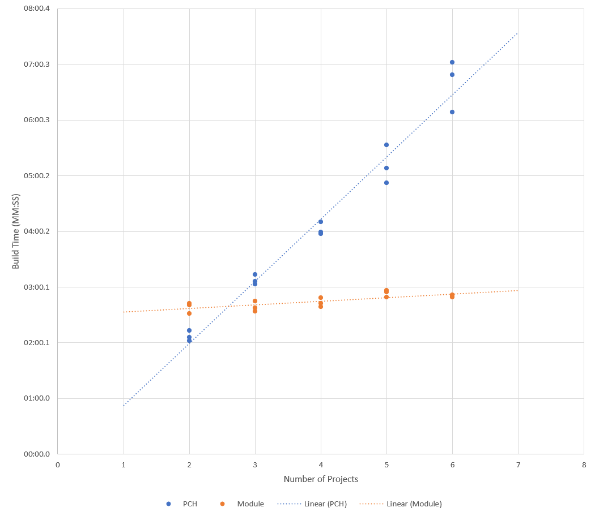

# Benchmarks

This branch is used for trying to compare build times for the modules and the PCH versions of our scenarios here.


## Directions

Start by opening a VS Dev Command Prompt. 

To measure how long the modules build takes: 
```
msbuild /bl:dbgmodx64.binlog /t:rebuild /p:platform=x64;configuration=debugmod Scenarios.sln
```

For the PCH build:
```
msbuild /bl:dbgpchx64.binlog /t:rebuild /p:platform=x64;configuration=debugpch Scenarios.sln
```


## Variations

_Terminology_: When I refer to 4 projects, I mean the first 4 building scenarios:

> * `01-SimpleConsoleApp`: This is basically the "hello world" for winrt. Create a `Uri`, and print the `Domain`.
> * `02-SimpleAsyncAction`: This is a simple console app to demonstrate async in winrt. This is taken from the PR body of [microsoft/cppwinrt/953].
> * `03-SimpleCustomComponent`: A WinRT library (`.dll`) that authors a custom WinRT type, which can be used in other WinRT projects.
> * `04-CustomConsoleApp`: Basically the hello-world project, but also consuming a type we authored in `03-SimpleCustomComponent`.

For the variations with more projects, I'm just copy-pasting the `02-SimpleAsyncAction` project additional times, to create more copies of it in the repo.

The "Full" projection is one that includes all of the cppwinrt headers that ship as a part of the platform projection.

The "minimal" projection is just `Windows.Foundation.h`, `Windows.Foundation.Collections.h`, `Windows.Web.h`, and `Windows.Web.Syndication.h`, which were all that's actually needed for these simple test projects.



Build  | Projects | Projection | time    | average
-------|----------|------------|---------|--------
PCH    | 2        | Full       | 2:06.05  |
PCH    | 2        | Full       | 2:02.42  |
PCH    | 2        | Full       | 2:12.92  |
PCH    | 2        | Full       |   |
Module | 2        | Full       | 2:42.67 |
Module | 2        | Full       | 2:40.63 |
Module | 2        | Full       | 2:31.34 |
Module | 2        | Full       |   |
PCH    | 3        | Full       | 3:13.46 |
PCH    | 3        | Full       | 3:03.21 |
PCH    | 3        | Full       | 3:06.28 |
PCH    | 3        | Full       |   |
Module | 3        | Full       | 2:45.15 |
Module | 3        | Full       | 2:37.33 |
Module | 3        | Full       | 2:34.21 |
Module | 3        | Full       |   |
PCH    | 4        | Full       | 3:59.32 |
PCH    | 4        | Full       | 4:10.24 |
PCH    | 4        | Full       | 3:57.66 |
PCH    | 4        | Full       |         | **4:02.41**
Module | 4        | Full       | 2:42.32 |
Module | 4        | Full       | 2:38.57 |
Module | 4        | Full       | 2:48.47 |
Module | 4        | Full       |         | **2:43.12**
PCH    | 5        | Full       | 4:52.16 |
PCH    | 5        | Full       | 5:08.18 |
PCH    | 5        | Full       | 5:33.53 |
PCH    | 5        | Full       |         | **5:11.29**
Module | 5        | Full       | 2:54.55 |
Module | 5        | Full       | 2:49.25 |
Module | 5        | Full       | 2:56.52 |
Module | 5        | Full       |         | **2:53.44**
PCH    | 6        | Full       | 7:02.14 |
PCH    | 6        | Full       | 6:08.91 |
PCH    | 6        | Full       | 6:48.74 |
PCH    | 6        | Full       |         | **6:39.93**
Module | 6        | Full       | 2:50.27 |
Module | 6        | Full       | 2:49.36 |
Module | 6        | Full       | 2:51.59 |
Module | 6        | Full       |         | **2:50.41**
PCH    | 4        | Minimal    | 0:23.20 |
PCH    | 4        | Minimal    | 0:23.98 |
PCH    | 4        | Minimal    | 0:24.47 |
PCH    | 4        | Minimal    |         |
Module | 4        | Minimal    | 0:21.67 |
Module | 4        | Minimal    | 0:20.25 |
Module | 4        | Minimal    | 0:19.52 |
Module | 4        | Minimal    |         |

Three projects that use the entirety of the Windows namespace is the breakeven point for the module being more overall performant. Optimizations could be made to trim the winrt module, if not everything is needed in a particular solution.

* [ ] TODO: Single project, full projections
* [ ] TODO: Single project, minimal projections


[microsoft/cppwinrt/953]: https://github.com/microsoft/cppwinrt/pull/953
